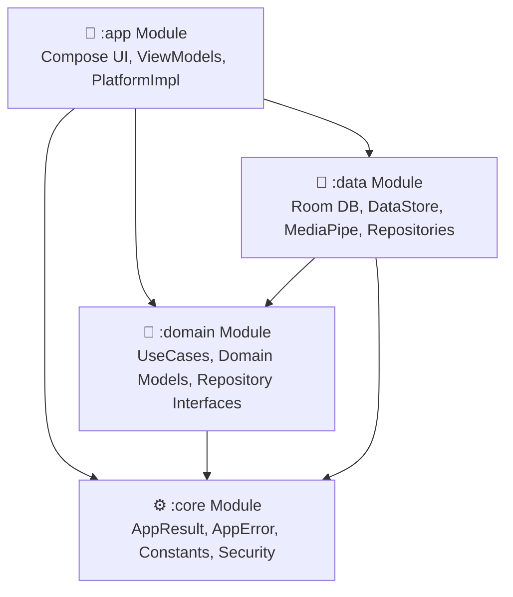
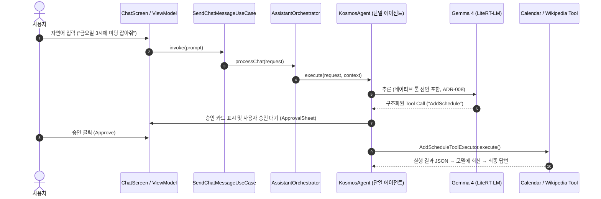

# 🗓️ lets_meet_on_friday (KOSMOS)
> **On-Device AI 기반의 개인정보 보호형 지능형 비서 & 일정 관리 안드로이드 애플리케이션**


---

## 📌 프로젝트 소개 (Overview)

`lets_meet_on_friday` (프로젝트 코드명: **KOSMOS**)는 서버 연동 없이 기기 내부에서 직접 구동되는 **Google Gemma 4** 모델 기반의 **On-Device AI 개인 비서 앱**입니다.

사용자의 대화 흐름, 일정 등록, 문서 및 음성 처리 과정에서 외부 서버로 개인정보가 유출되지 않는 **Strict Privacy-First** 환경을 제공하며, 자연어로 입력된 요청을 스스로 판단하여 적절한 도구(Calendar, Wikipedia 등)를 실행하는 **Multi-Agent Orchestration 파이프라인**을 탑재하고 있습니다.

---

## ✨ 핵심 기능 (Key Features)

- 🤖 **On-Device AI LLM Chat**: 네트워크 연결 없이 로컬에서 Gemma 4 모델을 추론하고 실시간 스트리밍 답변을 제공합니다.
- 📅 **Smart Calendar Agent & Floating Draft**: 자연어 대화에서 날짜와 일정을 자동으로 인식하여 일정 추가 초안 카드(Draft Card)를 제공하고, 사용자 승인 후 안드로이드 시스템 캘린더와 연동합니다.
- 🎙️ **Voice Input & 16kHz Audio Pipeline**: 마이크 입력을 Gemma 지원 규격(16kHz Mono 16-bit PCM WAV)으로 즉시 인코딩하여 멀티모달 음성 명령을 처리합니다.
- 📑 **Multimodal Attachment**: 이미지 및 다량의 텍스트 문서를 첨부하여 요약 및 지식 추출 질의를 수행합니다.
- 🛡️ **Tool Approval & Security Guard**: 캘린더 등록, 웹 검색 등 외부 영향을 주는 툴 액션 실행 전 사용자의 명시적 승인을 거치는 보안 레이어를 제공합니다.
- 📦 **Memory Backup & Export/Import**: SQLite WAL 및 백업 압축을 활용하여 지식 및 일정 데이터를 안전하게 내보내고 복원합니다.

---

## 🏗️ 멀티 모듈 아키텍처 (Architecture)

프로젝트는 **Clean Architecture** 원칙에 따라 관심사를 명확히 분리한 4개의 Gradle 모듈로 구성되어 있습니다.



### 모듈별 역할
- **`:app`**: Jetpack Compose UI, ViewModels, Hilt DI 구성, Android Platform 기능(Speech, Storage, Share 등) 구현체
- **`:domain`**: 비즈니스 유즈케이스([GetTodayScheduleUseCase](file:///c:/Users/J/Desktop/J-Dev/lets_meet_on_friday/domain/src/main/java/com/kosmos/app/domain/usecase/GetTodayScheduleUseCase.kt), `AddScheduleUseCase` 등), 도메인 엔티티 및 Repository/ModelRunner 인터페이스 (Pure Kotlin)
- **`:data`**: Room Database, DataStore, MediaPipe Text Embedder, Wikipedia API 도구 및 Repository 구현체
- **`:core`**: 전역 에러 핸들링([AppResult](file:///c:/Users/J/Desktop/J-Dev/lets_meet_on_friday/core/src/main/java/com/kosmos/app/core/common/AppResult.kt), [AppError](file:///c:/Users/J/Desktop/J-Dev/lets_meet_on_friday/core/src/main/java/com/kosmos/app/core/common/AppError.kt)), 전역 상수([Constants](file:///c:/Users/J/Desktop/J-Dev/lets_meet_on_friday/core/src/main/java/com/kosmos/app/core/common/Constants.kt)), 로깅 유틸리티 및 보안 정책

---

## 🤖 On-Device AI Agent 파이프라인 흐름



---

## 🛠️ 기술 스택 (Tech Stack)

| 분류 | 기술 및 라이브러리 |
| :--- | :--- |
| **Language** | Kotlin `2.4.10` |
| **Build & Plugin** | AGP `9.0+`, Gradle KTS, KSP |
| **UI & Styling** | Jetpack Compose, Material 3, Glassmorphism, Custom Aurora Animations, 라이트/다크 테마 전환 (시맨틱 색상 토큰) |
| **Architecture** | Clean Architecture, Multi-Module, Reactive Flow / StateFlow |
| **Dependency Injection** | Hilt |
| **On-Device AI** | LiteRT-LM (`litertlm-android` 0.16.0), Gemma 4-E4B-it INT4 |
| **Local Storage** | Room Database, Android DataStore, SQLite WAL |
| **Network & Speech** | OkHttp 4, Android AudioRecord (16kHz PCM WAV, 최대 30초) |
| **Testing** | Robolectric, Compose UI Test Rule, JUnit4 |

---

## 🚀 시작하기 (Getting Started)

### 사전 요구사항 (Prerequisites)
- **Android Studio**: Ladybug (2024.2.1) 이상 권장
- **JDK**: JDK 17 이상
- **Android SDK**: Min SDK 26 (Android 8.0+), Target SDK 37

### 설치 및 빌드 방법
```bash
# 1. 레포지토리 클론
git clone https://github.com/kang987654/lets_meet_on_friday.git
cd lets_meet_on_friday

# 2. 온디바이스 모델 준비 (.litertlm)
# 모델(약 3.6GB)은 APK 에 번들할 수 없어 앱이 직접 내려받거나 sideload 합니다.
#  - 권장: 앱 실행 → 설정 > 모델 관리 > 내려받기 (HuggingFace, 이어받기 지원)
#  - 수동: gemma-4-E4B-it.litertlm 파일을 기기의 앱 전용 폴더에 복사
#    (Android/data/<패키지>/files/models/ — 파일명이 정확히 일치해야 합니다)

# 3. 프로젝트 빌드
./gradlew build -x test
```

---

## 🧪 테스트 실행 (Testing & Verification)

본 프로젝트는 Robolectric 기반의 Compose E2E 통합 테스트와 단위 테스트가 구축되어 있습니다.

```bash
# 전체 단위 및 Robolectric E2E 통합 테스트 실행
./gradlew test

# 특정 모듈 테스트 실행
./gradlew :app:testDebugUnitTest

# 안드로이드 정적 분석 실행
./gradlew lintDebug
```

---

## 📄 라이선스 (License)

본 프로젝트는 [MIT License](LICENSE)에 따라 자유롭게 이용 및 수정이 가능합니다.
