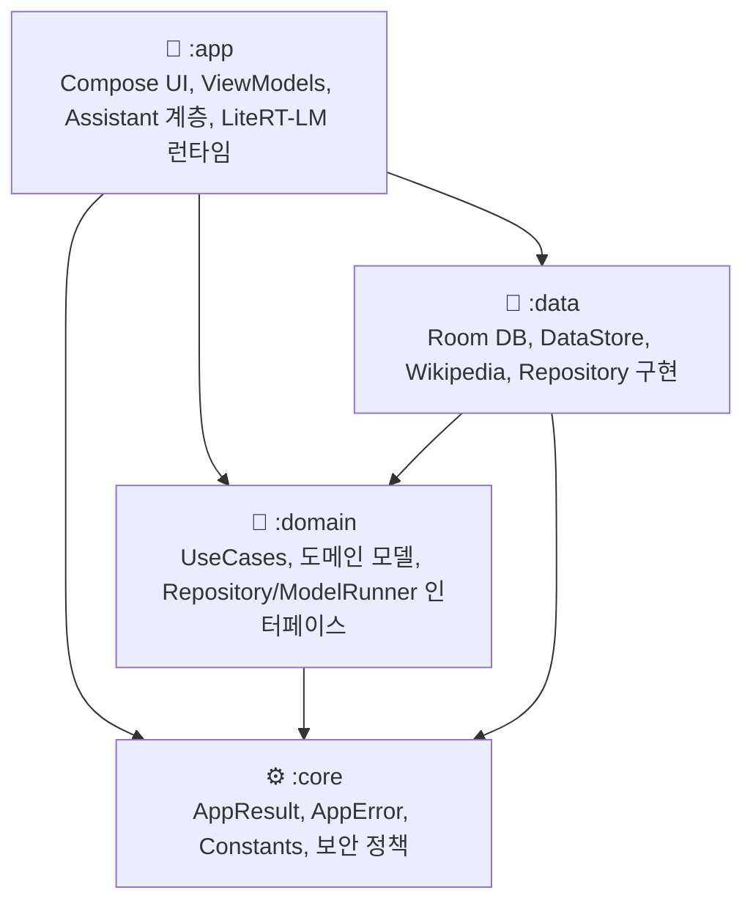
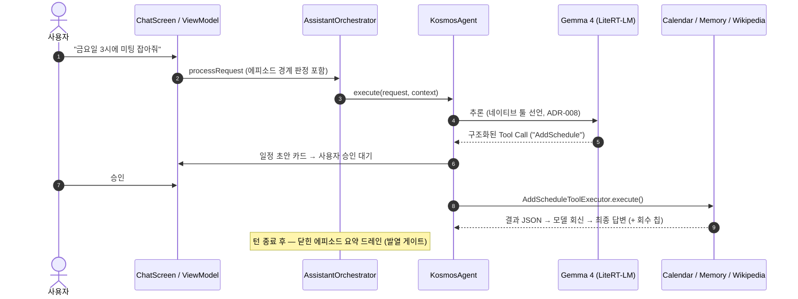

# 🗓️ lets_meet_on_friday (KOSMOS)
> **완전 온디바이스로 동작하는 개인정보 보호형 AI 비서 — 자동 분절되는 에피소드 기억을 가진 연속 대화 비서**


---

## 📌 프로젝트 소개

**KOSMOS** 는 서버 없이 기기 안에서만 동작하는 **Gemma 4 E4B(INT4, 3.6GB)** 기반 AI 개인 비서입니다.
대화·일정·음성·이미지 처리 전 과정에서 개인정보가 기기 밖으로 나가지 않으며(유일한 예외는
사용자가 명시적으로 켜는 위키백과 검색), 자연어 요청을 스스로 판단해 도구(캘린더·기억·검색)를
실행합니다.

세 가지가 이 프로젝트의 성격을 정의합니다:

1. **세션 없는 비서** — 사용자에게는 하나의 연속 대화만 보입니다. 뒤에서 대화가 주제 단위
   에피소드로 자동 분절되고, 각 에피소드는 온디바이스 요약(제목/태그/요약)을 거쳐 **검색
   가능한 기억 문서**가 됩니다. 비서가 과거를 참조하면 답변에 회수 칩(🧠)으로 출처를
   표시합니다. ([설계 문서](docs/design/ui_a_prime.md), ADR-022)
2. **실측 주도 엔지니어링** — 모바일 GPU 의 FP16 정밀도 한계로 긴 문맥에서 숫자가 깨지는
   발병점(1,854~2,122 토큰)을 직접 실험으로 특정하고, 대화 예산을 그 아래(1,700)로 설계했습니다.
   30여 개의 재현 실험 스크립트가 [`scratch/lab/`](scratch/lab) 에 있습니다.
3. **무음 실패 제로 원칙** — "실패했는데 화면은 정상"인 경로를 결함으로 취급합니다.
   검색 실패·저장 실패·첨부 실패 전부가 사용자에게 정직하게 표시됩니다.

---

## ✨ 핵심 기능

- 🧠 **에피소드 기억 (Episodic Memory)**: 무활동 30분·컨텍스트 리셋을 경계로 대화를 자동
  분절 → 턴 종료 후 oneShot 요약 → 드로어의 "기억 아카이브"에서 열람·수정·삭제.
  모델은 SearchMemory 툴로 같은 저장소를 회수하고, 답변에 참조 출처 칩을 답니다.
- 💬 **연속 타임라인 UI**: "새 세션" 버튼이 없습니다. 과거 대화 전체를 앵커 기반
  Paging 으로 무한 스크롤하고, 기억 문서에서 원문 대화 위치로 점프합니다.
- 📅 **캘린더 에이전트**: 자연어("금요일 3시에 미팅")에서 일정 초안 카드를 만들고, 사용자
  승인 후 기기 캘린더에 등록합니다. 조회는 앱 일정 + 기기 캘린더 병합.
- 🎙️ **음성 입출력**: 마이크 입력을 16kHz PCM 으로 인코딩해 Gemma 4 네이티브 오디오
  입력으로 전사·응답 (최대 30초, 자동 종료).
- 📷 **멀티모달 첨부**: 이미지(최대 12MP 실기기 검증)·텍스트 문서 첨부 질의.
- 🌐 **웹 검색 토글**: 기본 차단. 입력바의 토글로 명시 허용한 턴만 위키백과를 검색하고,
  검색이 실제로 쓰인 답변에만 근거 뱃지를 답니다 (실패 시 실패 안내 — 무음 오표시 없음).
- 🛡️ **승인·감사 레이어**: 쓰기 작업(일정·기억 저장)은 승인 카드를 거치고, 모든 툴 실행이
  감사 기록으로 남습니다.
- 📦 **백업**: 기억·일정 데이터 ZIP 내보내기/가져오기 (SQLite WAL 체크포인트 포함).

---

## 🔬 실측이 결정한 설계들

이 프로젝트의 주요 결정은 추정이 아니라 실험 기록에 근거합니다. 전 과정은
[CHANGELOG](docs/CHANGELOG.md) 와 [architecture.md](docs/architecture.md) 의 ADR 23개에 남아 있습니다.

| 결정 | 근거 실측 |
|---|---|
| 대화 프리필 예산 1,700 토큰 | GPU FP16 활성화 정밀도 × 문맥 깊이 — 숫자 깨짐 발병점 1,854~2,122 실측 (exp29~32, ADR-021) |
| 에피소드 자동 분절·요약·회수 | 실기기 대화 픽스처로 분절 자연성 9/9, 요약 형식 9/9, recall@1 16/16 — 임베딩 없이 (exp33, ADR-022) |
| 문서 첨부 캡 300자 | 슬라이딩 윈도우 생존 조건에서 역산 — 캡 초과 문서는 다음 턴부터 모델이 "본 적 없는" 상태가 됨 |
| 툴 선언 오버헤드 | 5종 652토큰 실측 — 툴 추가 예산 상한의 근거 |
| 추론 타임아웃 = 무활동 120초 | 총시간 기준은 긴 정상 답변을 죽임 — 행(hang)의 특징은 토큰이 안 오는 것 |

---

## 🏗️ 멀티 모듈 아키텍처

**Clean Architecture** 원칙에 따라 4개의 Gradle 모듈로 분리되어 있습니다.



- **`:app`** — Compose UI(글래스모피즘·라이트/다크 토큰), 에이전트 오케스트레이션, 에피소드
  경계 감지·요약 스케줄러, GemmaModelRunner (LiteRT-LM)
- **`:domain`** — Pure Kotlin. 유즈케이스·도메인 모델·인터페이스만
- **`:data`** — Room(마이그레이션 6판), DataStore, 위키 API
- **`:core`** — [AppResult](core/src/main/java/com/kosmos/app/core/common/AppResult.kt) /
  [AppError](core/src/main/java/com/kosmos/app/core/common/AppError.kt) 전역 오류 체계,
  [Constants](core/src/main/java/com/kosmos/app/core/common/Constants.kt) (모든 예산 상수의 단일 출처 — 각 값에 실측 근거 주석)

---

## 🤖 에이전트 파이프라인



---

## 🛠️ 기술 스택

| 분류 | 기술 |
| :--- | :--- |
| **Language / Build** | Kotlin `2.4.10`, AGP `9.3`, Gradle KTS, KSP |
| **UI** | Jetpack Compose (Material 3), 글래스모피즘 + 오로라 배경, 라이트/다크 시맨틱 토큰 |
| **Architecture** | Clean Architecture, 4-모듈, Flow / StateFlow, Paging 3 |
| **DI** | Hilt |
| **On-Device AI** | LiteRT-LM `0.16.0`, Gemma 4-E4B-it INT4 (GPU 델리게이트 + CPU 폴백) |
| **Storage** | Room (스키마 v6), DataStore, SQLite WAL |
| **Network / Audio** | OkHttp 4 (위키·모델 다운로드, Wi-Fi 전용 정책), AudioRecord 16kHz PCM |
| **Testing** | JUnit4 + Robolectric + Compose UI Test — 단위·통합·E2E 300여 건 |

---

## 🚀 시작하기

### 요구사항
- Android Studio (2024.2.1+), JDK 17+
- Min SDK 26 / Target SDK 37 — 실기기 검증 기기: Galaxy S25 Ultra

### 빌드
```bash
git clone https://github.com/kang987654/lets_meet_on_friday.git
cd lets_meet_on_friday
./gradlew assembleDebug
```

### 모델 준비 (.litertlm, 약 3.6GB — APK 미포함)
- **권장**: 앱 실행 → 스플래시의 "모델 내려받기" 또는 설정 > 모델 관리 (HuggingFace, 이어받기·백그라운드 지원)
- **수동**: `gemma-4-E4B-it.litertlm` 을 `Android/data/<패키지>/files/models/` 에 복사

### 테스트
```bash
./gradlew test        # 단위 + Robolectric E2E 통합 (300여 건)
./gradlew lintDebug   # 정적 분석 (경고 0 기준선)
```

---

## 📚 문서 지도

| 문서 | 내용 |
|---|---|
| [PRD.md](docs/PRD.md) | 제품 요구사항 — 목표·비목표·AC/EC |
| [architecture.md](docs/architecture.md) | 구조 + **ADR 23개** (모든 주요 결정의 맥락과 근거) |
| [CHANGELOG.md](docs/CHANGELOG.md) | 회차별 상세 기록 — 결함의 원인 분석까지 |
| [design/ui_a_prime.md](docs/design/ui_a_prime.md) | "세션 없는 비서" UI 설계와 검증 |
| [expand.md](docs/expand.md) | 확장 로드맵 — 실측 제약 기반 |
| [scratch/lab/](scratch/lab) | 실기기 없이 재현하는 모델 실험실 (exp1~33) |

---

## 📄 저작권

ⓒ 2026 jinwoo. All rights reserved.

본 저장소는 **포트폴리오 열람 목적으로 공개**된 것으로, 별도의 오픈소스 라이선스를 부여하지
않습니다. 코드와 문서의 열람은 자유이나, 사전 허가 없는 사용·복제·수정·재배포는 허용되지
않습니다. (Gemma 모델은 저장소에 포함되지 않으며, 사용 시 Google 의 Gemma Terms of Use 를
따릅니다.)
