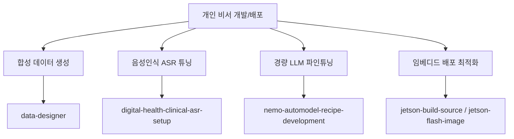
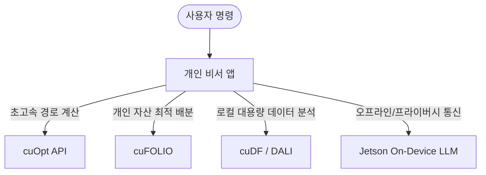

# NVIDIA Agent Skills 분석 및 개인 비서 앱 활용 전략
> **문서 버전**: v1.0 | **최종 수정일**: 2026-07-31 | **상태**: Approved (승인)
> **관련 모듈**: 프로젝트 전 영역 (개발 프로세스 참고 자료)

이 문서는 [NVIDIA Agent Skills](https://github.com/NVIDIA/skills/tree/main/skills) 레포지토리에 수록된 공식 검증 기술(Skills)을 분석하고, 이를 **개인 비서 앱** 프로젝트의 **개발 과정**과 **런타임 기능** 측면으로 분류하여 정리한 보고서입니다.

---

## 1. NVIDIA Agent Skills 개요 및 주요 분류

NVIDIA Agent Skills는 AI 에이전트(Claude Code, Cursor, Cursor AI 등)가 NVIDIA의 가속 컴퓨팅 라이브러리(CUDA-X), AI Blueprints, 하드웨어 플랫폼 등을 효율적이고 안전하게 제어하여 작업을 완수할 수 있도록 돕는 **이식 가능한 지침 및 코드 템플릿 세트(Portable Instruction Sets)**입니다.

전체 스킬 목록은 아래와 같이 크게 5가지 영역으로 분류할 수 있습니다.

| 대분류 | 주요 포함 기술 (스킬명 예시) | 핵심 역할 |
| :--- | :--- | :--- |
| **LLM 학습 및 튜닝** | NeMo, Megatron-Core (`nemo-*`, `mcore-*`) | 거대 언어 모델(LLM)의 파인튜닝, 분산 학습, 가드레일 설정 및 평가 자동화 |
| **데이터 및 가속 연산** | cuDF, DALI, cuPyNumeric (`accelerated-computing-cudf`, `dali-*`, `cupynumeric-*`) | GPU 가속 기반 데이터프레임 처리, 고성능 데이터 로딩, 행렬 연산 가속 |
| **수치 및 경로 최적화** | cuOpt, cuFOLIO (`cuopt-*`, `cufolio`) | 물류/차량 경로 최적화(VRP), 포트폴리오 리밸런싱, 선형/비선형 최적화 API 제어 |
| **Edge AI 및 하드웨어** | Jetson BSP, Holoscan SDK (`jetson-*`, `holoscan-*`, `hsb-*`) | 임베디드 디바이스(Jetson) 펌웨어 제어, 센서 연동, On-Device LLM 최적 서빙 |
| **도메인 특화 AI** | Digital Health, Earth2Studio (`digital-health-*`, `earth2studio-*`) | 임상 음성인식(ASR) 구축, 기상 및 기후 예측 시뮬레이션 모델 파이프라인 |

---

## 2. 개인 비서 앱 관련 활용 구분

개인 비서 앱을 기획하고 제공하는 관점에서 NVIDIA Skills는 **(1) 비서 앱을 구축하고 튜닝하는 개발 단계**와, **(2) 실제 사용자가 비서 앱을 사용할 때 백엔드/온디바이스 툴로 작동하는 런타임 단계**로 나눌 수 있습니다.

### A. 개발 과정에서의 Skills (Development & Engineering Phase)

개발자 또는 개발 보조 AI 에이전트가 개인 비서 앱을 고도화하고 학습시키는 엔지니어링 파이프라인에서 필수적으로 쓰이는 스킬들입니다.

1. **비서 앱 전용 커스텀 LLM 파인튜닝 및 평가**
   * **관련 스킬**: `nemo-automodel-recipe-development`, `mcore-testing`, `nemo-evaluator-plugin`
   * **역할**: 개인 비서의 페르소나, 특수 명령어 세트, 대화 스타일을 반영하기 위해 가벼운 LLM(예: NeMo 12B, Llama 8B)을 파인튜닝하고 성능을 객관적으로 자동 평가합니다.
2. **합성 데이터셋 구축**
   * **관련 스킬**: `data-designer`
   * **역할**: 비서 앱이 마주할 수 있는 다양한 대화 시나리오(예: 일정 취소, 알람 예약 변경, 복잡한 질문 등)에 대응할 수 있도록 풍부한 합성 대화 데이터셋을 사전 생성하여 모델의 강인함을 확보합니다.
3. **사용자 음성 인터페이스(ASR) 튜닝**
   * **관련 스킬**: `digital-health-clinical-asr-setup`, `digital-health-clinical-asr-finetune`
   * **역할**: 비서 앱의 핵심인 음성 명령 인식율을 높이기 위해 음성인식(ASR) 모델의 전처리 및 파인튜닝 환경을 셋업합니다. (헬스케어 뿐만 아니라 일상 음성의 고품질 인식에 응용 가능)
4. **엣지 디바이스(Edge AI) 기반 하드웨어 비서 배포**
   * **관련 스킬**: `jetson-build-source`, `jetson-flash-image`, `jetson-init-target`
   * **역할**: 개인 비서를 전용 물리 디바이스(홈 IoT 허브, 스마트 스피커, 개인 로봇 등)에 배포하기 위해 Jetson 보드의 리눅스 BSP 빌드 및 OS 플래싱 과정을 자동화합니다.

---

### B. 앱에서 직접 실행할 런타임 Skills (Application Runtime Features)

비서 앱이 가동 중일 때, 사용자의 음성/텍스트 명령을 해결하기 위한 **백엔드 기능(Tools / API)**으로 직접 구동되는 스킬들입니다.

1. **사용자 맞춤형 복합 동선 추천 (경로 최적화)**
   * **관련 스킬**: `cuopt-routing-api-python`, `cuopt-server-api-python`
   * **사용 예시**: 사용자가 *"오늘 처리해야 할 미팅 5개와 마트 들르기 일정이 있어. 운전 시간을 최소화할 수 있는 가장 효율적인 동선을 짜줘."*라고 말할 때, 비서 앱이 cuOpt API를 실시간 호출하여 수 밀리초 만에 최적의 경로를 정렬해 제공합니다.
2. **재정 관리 및 개인 투자 포트폴리오 제안**
   * **관련 스킬**: `cufolio`
   * **사용 예시**: 사용자가 *"내 투자 선호도와 자산 상황에 최적화된 리밸런싱 포트폴리오를 만들어줘."*라고 요청할 경우, 고성능 금융 포트폴리오 최적화 알고리즘을 런타임에 실행하여 맞춤형 자산 비율을 산출합니다.
3. **사용자 개인 대용량 데이터의 즉각적인 처리 및 분석**
   * **관련 스킬**: `accelerated-computing-cudf`, `dali-dynamic-mode`
   * **사용 예시**: 사용자가 폰에 저장된 수년치 일정 엑셀 파일이나 영수증 CSV 파일, 다수의 미디어 파일을 첨부하며 *"최근 1년간의 소비 패턴을 그래프로 요약해줘."*라고 할 때, GPU 가속 cuDF와 DALI를 활용하여 대량의 데이터프레임과 파일을 지연 없이 실시간 분석 가공합니다.
4. **오프라인 및 프라이버시가 강화된 온디바이스(On-Device) AI 서빙**
   * **관련 스킬**: `jetson-llm-serve`, `jetson-speculative-decoding`
   * **사용 예시**: 프라이버시 보호가 엄격히 필요하거나 인터넷 연결이 없는 상황(예: 비행기 모드, 지하시설)에서 기기 자체(Jetson 기반 스마트 장비)에 탑재된 경량 LLM이 사용자의 명령에 지연 시간(Latency) 없이 응답할 수 있도록 Speculative Decoding 등 가속 기술 기반으로 모델을 구동합니다.
